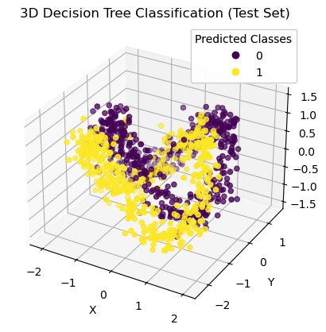
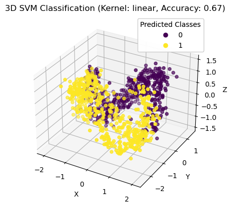
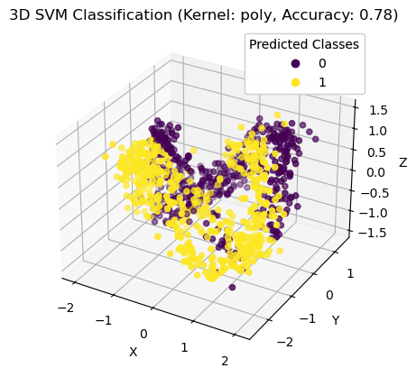
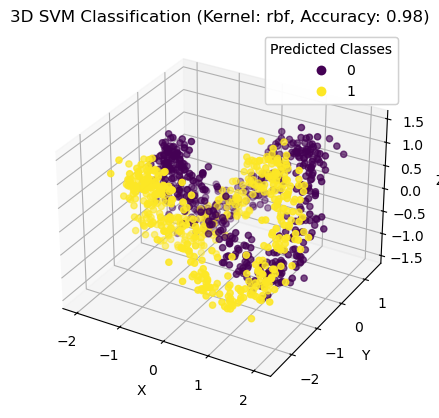
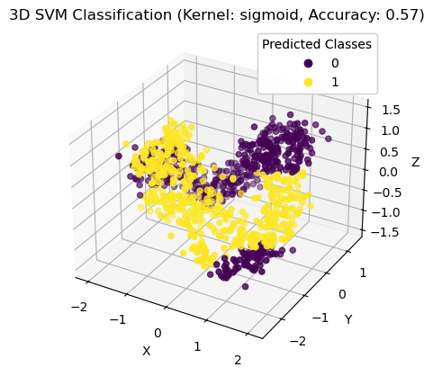

---

## 北京航空航天大学  
**PRML第二次作业报告**  
**几种分类器在月牙形数据上的表现分析**  

---

### 几种分类器在月牙形数据上的表现分析
##### 22375126 吴尔伦

#### 1. 概述

在本实验中，我们使用了三种经典的分类方法——**决策树**（Decision Tree）、**决策树结合AdaBoost**（AdaBoost + Decision Tree），以及**支持向量机**（SVM）来对基于三维月牙形数据生成的数据集进行分类。该数据集具有明显的非线性分布，常见的分类算法可能面临较大的挑战。因此，本实验旨在比较这些分类器在不同参数配置下的表现，深入分析其在月牙形数据上的表现及其背后的原因。

#### 2. 方法概述

1. **决策树（Decision Tree）**：决策树是一种常见的监督学习方法，它通过分裂训练数据的特征来构建树形结构，进而进行分类决策。决策树的关键超参数是树的最大深度，深度过大会导致模型复杂度过高，容易发生过拟合；深度过小，则可能导致欠拟合，无法捕捉数据的复杂性。

2. **决策树 + AdaBoost（AdaBoost + Decision Tree）**：AdaBoost是一种集成学习方法，旨在通过训练多个弱分类器并加权组合它们的结果来提高分类性能。与单个决策树相比，AdaBoost能够通过加权组合多个弱分类器来增强模型的鲁棒性，从而减少过拟合现象。

3. **支持向量机（SVM）**：SVM是一种强大的分类算法，通过寻找数据中不同类别之间的最大间隔来实现分类。SVM的表现与所使用的核函数密切相关，常见的核函数包括线性核、多项式核、径向基核（RBF）和Sigmoid核。不同的核函数会对分类效果产生显著影响，尤其是在处理非线性数据时。

#### 3. 实验设计与结果

##### 3.1 数据集

为了评估不同分类方法的表现，我们生成了基于三维月牙形数据的训练集和测试集。生成的三维数据包含100个训练样本和500个测试样本，每个样本的特征由三个变量（x, y, z）构成，其中x和z值随时间变化而变化，y值则包含一定的噪声。类别标签为0和1，代表两类不同的月牙形数据。

##### 3.2 实验结果

1. **决策树**：
   - 当决策树的最大深度设置为8时，分类器的准确率为95%。进一步增加树的深度会导致过拟合，准确率下降。这表明，决策树能够较好地拟合数据，但过于复杂的模型会导致其对训练数据的噪声敏感，从而降低泛化能力。
   
   
2. **决策树 + AdaBoost**：
   - 在AdaBoost中，当决策树的最大深度设置为4时，表现出最佳的准确率（97%）。随着决策树深度的增加，准确率开始下降，这说明过深的基分类器可能会带来过拟合。AdaBoost通过集成多个较浅的分类器有效地降低了过拟合现象，提高了模型的准确性和稳定性。
   

3. **支持向量机（SVM）**：
   - 在使用SVM时，我们尝试了四种不同的核函数，实验结果如下：
     - **线性核（Linear）**：准确率为0.67，表现较差。线性核假设数据是线性可分的，但月牙形数据明显是非线性分布，因此该核函数不能很好地处理数据的复杂性。
     
     - **多项式核（Poly）**：准确率为0.78，略有提升。多项式核通过增加特征空间的维度，试图捕捉数据的非线性关系，但仍无法与后面的RBF核相媲美。
     
     - **径向基核（RBF）**：准确率为0.98，表现最佳。RBF核通过将数据映射到更高维的空间，能够有效处理数据的非线性结构，从而提供了最好的分类效果。
     
     - **Sigmoid核（Sigmoid）**：准确率为0.57，表现较差。Sigmoid核通常用于神经网络，但在这个实验中，由于其非线性特性与月牙形数据不匹配，导致了较差的分类性能。
     

#### 4. 参数分析

- **决策树的最大深度**：
  - 决策树的最大深度直接影响其拟合能力。较小的深度能够防止过拟合，并保持较好的准确性。当树的深度过大时，模型的复杂度急剧增加，容易对训练数据中的噪声产生过拟合，从而导致在测试集上的准确性下降。因此，控制决策树的最大深度是防止过拟合的关键。

- **AdaBoost中的基分类器深度**：
  - AdaBoost的优势在于它能够通过组合多个弱分类器来提高分类性能。在本实验中，基分类器的深度选择为4时，表现最佳。过深的决策树会导致AdaBoost的效果变差，增加过拟合的风险。通过选择较浅的基分类器（深度为4），AdaBoost能够避免过拟合，并有效提高分类准确率。

- **SVM核函数的选择**：
  - SVM的表现强烈依赖于核函数的选择。在本实验中，RBF核提供了最好的分类结果，因为它能够通过非线性映射有效处理月牙形数据的复杂性。其他核函数（如线性核和Sigmoid核）未能很好地捕捉数据的非线性特性，导致性能较差。

#### 5. 结果总结与分析

- **决策树**：决策树在适当调整最大深度时能够提供良好的分类性能，但容易受到过拟合问题的影响。合理的深度（如8）能提供较高的准确率。
- **AdaBoost + 决策树**：通过集成多个弱分类器，AdaBoost能够有效提高决策树的性能，减少过拟合问题。最优基分类器深度为4时，AdaBoost提供了最佳的准确率。
- **支持向量机（SVM）**：SVM在处理非线性数据时表现良好，但核函数的选择至关重要。RBF核能够提供最佳性能，而其他核函数（如线性核和Sigmoid核）则表现较差。

#### 6. 结论

在本次实验中，基于月牙形数据的分类任务中，**AdaBoost + 决策树**和**RBF核SVM**是最优的选择。它们能够有效地处理数据的非线性分布并且避免过拟合。而单一的决策树和某些SVM核函数（如线性核和Sigmoid核）在此任务中的表现较差。

推荐的分类方法为**AdaBoost + 决策树**，它结合了决策树的简单性和AdaBoost的集成优势，适用于此类复杂的非线性问题。
