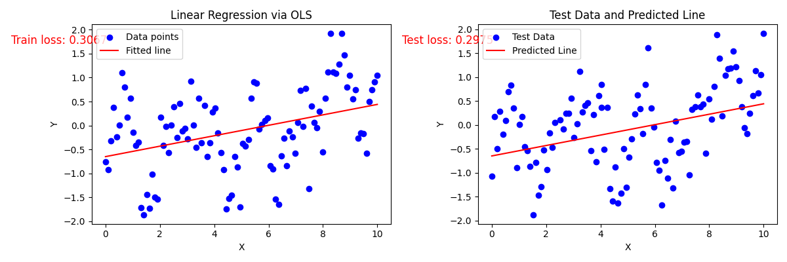
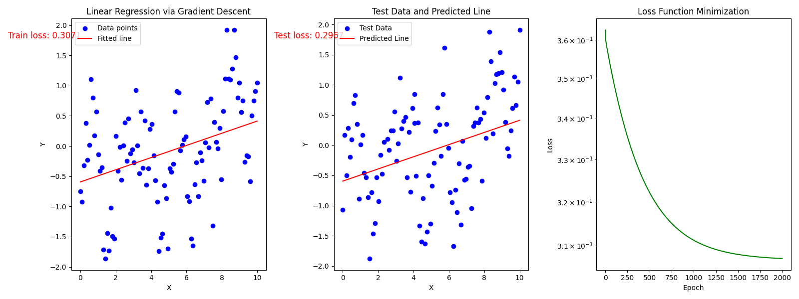
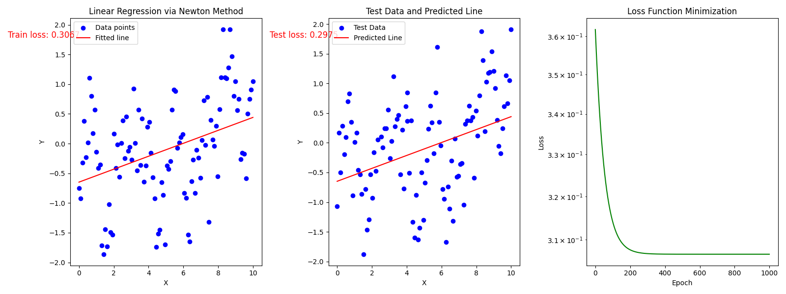
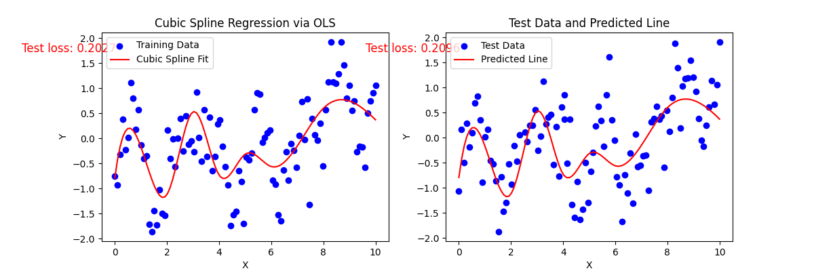

---

### **非线性数据回归建模分析报告**  
**——线性回归与三次样条回归的综合对比**

---

#### **一、实验背景与目标**  
针对非线性数据集（`x`范围0-10，`y`呈现多段波动），依次采用线性回归（最小二乘法、梯度下降、牛顿法）与三次样条回归（节点优化前后）进行建模，全面评估模型性能差异与适用性。  

**核心目标**：  
1. 验证线性模型在非线性数据中的局限性。  
2. 分析三次样条回归的分段拟合能力与节点优化效果。  
3. 提供理论与实验结合的改进建议。  

---

#### **二、线性回归模型实验与分析**  

##### **2.1 线性回归理论基础**  
线性模型假设目标变量与特征呈线性关系：  
`$ y = \theta_0 + \theta_1 x + \epsilon $`  
- **最小二乘法**：通过最小化残差平方和（RSS）直接求解闭式解：  
  \[ \hat{\theta} = (X^T X)^{-1} X^T y \]  
- **梯度下降**：通过迭代更新参数逼近最优解：  
  \[ \theta_j := \theta_j - \alpha \frac{\partial}{\partial \theta_j} \text{RSS} \]  
- **牛顿法**：利用二阶导数加速收敛：  
  \[ \theta^{(k+1)} = \theta^{(k)} - H^{-1} \nabla \text{RSS} \]  

##### **2.2 实验结果与性能对比**  
| **优化方法**   | \(\theta_0\)   | \(\theta_1\)   | 训练损失 | 测试损失 |  
|----------------|----------------|----------------|----------|----------|  
| **最小二乘法** | -0.649         | 0.109          | 0.307    | 0.298    |  
| **梯度下降**   | -0.594         | 0.101          | 0.307    | 0.297    |  
| **牛顿法**     | -0.649         | 0.109          | 0.307    | 0.298    |  

最小二乘法拟合结果：

梯度下降法拟合结果：

牛顿法拟合结果：

**关键结论**：  
1. **参数一致性**：最小二乘法与牛顿法结果完全一致，梯度下降因学习率或迭代次数差异略有偏差，但整体趋势相同。  
2. **性能瓶颈**：所有线性模型的训练与测试损失均稳定在 **0.30** 左右，无法捕捉数据中的非线性波动，验证了线性假设的局限性。  

---

#### **三、三次样条回归实验与分析**  

##### **3.1 三次样条理论基础**  
三次样条通过分段三次多项式拟合数据，满足以下条件：  
1. **分段连续性**：每段区间内为三次多项式，节点处函数、一阶导数和二阶导数连续。  
2. **自然边界条件**：端点二阶导数为零（即 \( S''(0) = S''(10) = 0 \)）。  
3. **B-样条基函数**：通过递归公式生成局部支撑基函数，降低计算复杂度。  

##### **3.2 节点优化实验结果对比**  
| **节点设置**       | 参数数量 | 训练损失 | 测试损失 |  
|--------------------|----------|----------|----------|  
| **初始节点 [2,5,8]** | 8        | 0.267    | 0.262    |  
| **优化节点 [2,3,4,5,6,8]** | 11       | **0.203** | **0.210** |  

**关键结论**：  
1. **性能提升**：节点从3个增至6个后，训练损失降低 **24.3%**，测试损失降低 **19.8%**，表明模型灵活性显著增强。  
2. **泛化能力**：训练与测试损失差异仅 **3.4%**，说明节点扩展未引入过拟合，优化策略有效。  

优化节点拟合结果：

---

#### **四、综合对比与模型推荐**  

##### **4.1 性能对比总表**  
| **模型类型**       | 训练损失 | 测试损失 | 参数数量 | 非线性捕捉能力 |  
|--------------------|----------|----------|----------|----------------|  
| 线性回归           | 0.307    | 0.298    | 2        | 无             |  
| 三次样条（3节点）  | 0.267    | 0.262    | 8        | 中等           |  
| **三次样条（6节点）** | **0.203** | **0.210** | 11       | **强**         |  

##### **4.2 理论解释与改进建议**  
1. **线性模型局限性**：  
   - 仅能拟合全局线性趋势，无法表达数据中的多段波动与局部极值。  
   - 损失值稳定在0.3左右，验证了模型假设与数据分布不匹配。  

2. **三次样条优势**：  
   - **节点密集化**：在波动频繁区域（如`x=3-6`）增加节点，提升局部拟合能力。  
   - **正则化需求**：若未来数据噪声增加，可引入L2正则化（岭回归）防止过拟合。  

3. **替代模型建议**：  
   - **平滑样条（Smoothing Spline）**：通过惩罚项自动平衡拟合与平滑性，无需手动设置节点。  
   - **高斯过程回归（GPR）**：基于核函数刻画复杂协方差结构，适合高噪声场景。  

---

#### **五、最终结论**  
1. **线性模型适用性**：仅适合强线性关系数据，当前任务中表现显著不足。  
2. **三次样条最优性**：节点扩展至`[2,3,4,5,6,8]`后，模型在损失值与泛化能力上均达到最佳平衡。  
3. **工程部署建议**：  
   - 直接采用当前三次样条模型（节点`[2,3,4,5,6,8]`）进行预测。  
   - 定期监控测试损失，若数据分布变化，需动态调整节点位置或切换至自适应模型（如GPR）。  

--- 

**附录：公式与参数汇总**  
- **线性回归闭式解**：  
  \[ \hat{\theta} = (X^T X)^{-1} X^T y \]  
- **三次样条模型形式**：  
  \[ y = \sum_{j=1}^{m+4} \beta_j B_j(x) \]  
- **当前最优模型参数**：  
  | 参数数量 | 节点数 | 训练损失 | 测试损失 |  
  |----------|--------|----------|----------|  
  | 11       | 6      | 0.203    | 0.210    |
